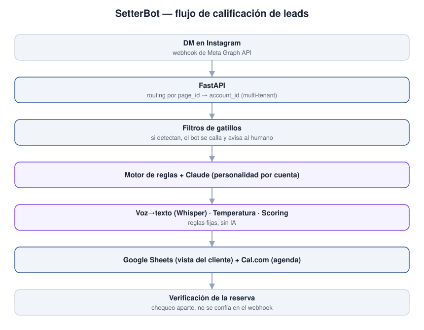

**🇦🇷 Español · 🇬🇧 [English](#-english)**

# SetterBot

> Agente de ventas automatizado que califica leads en Instagram y agenda llamadas para un closer humano.

**Este repositorio es una vitrina técnica, no el sistema.** El sistema en
producción es privado. Acá están la arquitectura, las decisiones de diseño, las
pruebas y algunos fragmentos de código elegidos para mostrar cómo está resuelto.

---

## El problema

Un coach con marca personal recibía decenas de mensajes por Instagram por día y
no podía responderlos todos, filtrar quién tenía intención real de comprar y
agendar la llamada de venta con su closer. Las herramientas de automatización
existentes (ManyChat, n8n) cobran por mensaje o resuelven con flujos visuales
que no dan el control fino que necesita la calificación de un lead.

El bot tenía que hacer el trabajo de un setter humano: saludar, calificar con
preguntas, detectar si el prospecto era el perfil correcto, medir temperatura
y recién pasar a agenda a los calientes. Y tenía que correr en las cuentas
reales del cliente, en producción, sin romper una conversación.

En el camino se probó el modelo multi-tenant: tres cuentas de cliente corriendo
en un solo servidor, cada una con su personalidad, sus preguntas y sus reglas,
editables desde un panel.

## Arquitectura



```
DM en Instagram
      │   Meta Graph API — webhook POST
      ▼
 FastAPI ────► routing por page_id ──► account_id
      │
      ▼
filtros de gatillos   (si detectan, el bot se calla y alerta al humano)
      │
      ▼
motor de reglas ──► Claude (personalidad por cuenta)
      │
      ├── transcripción de voz (se resuelve ANTES del motor de reglas)
      ├── temperatura del lead (cada 4+ mensajes)
      └── scoring (reglas fijas, sin IA)
      │
      ▼
 Google Sheets (vista del cliente)   Cal.com (link de agenda)
      │
      ▼
verificación de agenda (chequeo posterior, no se confía en el webhook)
```

**Flujo de datos:** el lead manda un DM y el webhook de Meta lo entrega a
FastAPI, que detecta la cuenta por `page_id` y asigna `account_id`. Antes de
llamar al LLM corren los filtros de gatillos: si detectan una pausa (consulta a
terceros, falta de intención, competencia) el bot se calla y genera una alerta
para el humano. Si no hay gatillo, Claude responde con la personalidad de esa
cuenta. Cada cuatro o más mensajes se evalúa la temperatura y se recalcula el
score. Todo se persiste en Google Sheets, que es la vista que el cliente ve y
edita. Cuando el lead quiere agendar, el bot le pasa el link de Cal.com y la
reserva se verifica con un chequeo posterior — nunca se da por agendado por el
solo hecho de recibir el webhook.

Detalle completo en [`docs/arquitectura.md`](docs/arquitectura.md).

## Stack

| Capa | Tecnología | Por qué esta y no otra |
|---|---|---|
| Backend | Python 3.10+ / FastAPI | Control total del flujo, sin suscripciones por mensaje |
| Base de datos visible | Google Sheets | El cliente ve y edita sus leads en tiempo real, sin herramientas técnicas |
| Interfaz | Panel `/admin` servido desde Python | Todo en un lenguaje y un proceso (ver decisión 4) |
| IA | OpenAI o Anthropic segun la cuenta · Groq Whisper (voz) | El proveedor se resuelve por cliente desde el prefijo de su API key, asi una cuenta puede correr en un modelo mas barato sin afectar a las demas |
| Integraciones | Meta Graph API · Cal.com | Instagram directo y agendamiento por link |
| Despliegue | Railway | URL fija sin ngrok, costo fijo bajo |

## Decisiones de diseño

Las decisiones que definieron el proyecto. **Cada una lleva las cuatro partes**:
qué se eligió, contra qué, por qué, y qué costó. La cuarta es la que importa —
una decisión sin costo declarado no es una decisión, es una preferencia.

### Verificación de agenda como paso aparte

- **Qué se hizo:** no se confía en el webhook de Cal.com. Hay un chequeo
  posterior de que la reserva existe: el lead queda en `agendado_no_verificado`
  hasta que un humano la confirma y recién ahí el bot continúa el flujo.
- **Alternativa descartada:** dar el lead por agendado apenas llega el webhook.
- **Por qué:** el webhook puede no llegar o llegar tarde, y un "agendado" falso
  contaminaba la cola del closer.
- **Qué costó:** una llamada más a la API y latencia en el cierre del flujo.

### La personalidad se construye desde conversaciones reales del cliente

- **Qué se hizo:** el prompt de cada cuenta se arma a partir de las
  conversaciones reales del cliente, para que el bot imite su estilo de cierre.
  Por eso el prompt es propiedad del cliente y no se publica.
- **Alternativa descartada:** un prompt genérico de "asistente de ventas".
- **Por qué:** el prospecto tiene que sentir que habla con el dueño, no con una
  IA genérica.
- **Qué costó:** no es portable entre clientes: hay que rehacerlo en cada
  onboarding.

### Multi-tenancy por configuración, no por fork por cliente

- **Qué se hizo:** reglas, preguntas y personalidad se editan desde el panel;
  los tres clientes corren en un solo servidor.
- **Alternativa descartada:** un fork y un deploy por cliente.
- **Por qué:** los tres clientes son independientes entre sí y no comparten
  nada, pero un deploy por cliente triplicaba servidores, costos y el esfuerzo
  de cada actualización para una sola persona. Con configuración, dar de alta
  una cuenta nueva es cargar datos, no tocar código ni desplegar.
- **Qué costó:** el panel creció mucho y la configuración quedó dispersa en
  varios módulos.

### Interfaz servida desde Python, sin motor de plantillas

- **Qué se hizo:** el panel `/admin` se sirve directamente desde Python.
- **Alternativa descartada:** un motor de plantillas separado o un frontend
  aparte.
- **Por qué:** aceleraba el arranque: un solo lenguaje, un solo proceso, cero
  build.
- **Qué costó:** y es un costo real — `admin.py` llegó a 8367 líneas. Es el
  ejemplo de una decisión que acelera al principio y se cobra después.

### Transcripción de voz dentro del mismo flujo de texto

- **Qué se hizo:** el audio se convierte en texto antes de entrar al motor de
  reglas; así el resto del sistema nunca sabe que el mensaje entró como audio.
- **Alternativa descartada:** un flujo separado de audio con su propio pipeline.
- **Por qué:** filtros, temperatura y scoring procesan una sola cosa: texto. La
  voz se resuelve en el borde, en `transcriber.py`.
- **Qué costó:** depende de un proveedor externo (Groq Whisper) y suma latencia
  al primer mensaje.

Detalle completo en [`docs/decisiones.md`](docs/decisiones.md).

## Decisiones sobre este repositorio

Por qué este repo se ve así y no como el proyecto entero:

- **Es una vitrina, no un espejo.** El sistema en producción tiene material de
  clientes: nombres reales, conversaciones reales, audio y datos de negocio.
  Publicarlo entero no era una opción, ni siquiera renombrando: la personalidad
  del bot está construida con transcripciones de conversaciones reales del
  cliente, que son propiedad de él.
- **Se publica lo que se lee, no lo que pesa.** Los archivos más grandes del
  sistema — `admin.py` (8367 líneas) y `agent.py` (5814) — no aportan a quien
  evalúa y muestran deuda técnica sin contexto. En su lugar van fragmentos
  elegidos: cada uno ilustra una decisión y se lee de un vistazo.
- **El único test va completo, y con honestidad.** `tests/test_no_fuga_cross_tenant.py`
  son 22 líneas con `print`s: es un script de verificación manual de que no hay
  fuga de datos entre cuentas, no una suite de pytest. Se presenta como lo que
  es. No hay otra suite en el proyecto.
- **Los nombres de clientes están reemplazados** por ficticios consistentes. No
  hay `[REDACTADO]` ni `XXXX`: un nombre inventado se lee como un ejemplo, un
  tachón se lee como un problema.

## Qué hay en este repositorio

| Carpeta | Qué contiene |
|---|---|
| [`docs/arquitectura.md`](docs/arquitectura.md) | Diagrama y flujo de datos |
| [`docs/decisiones.md`](docs/decisiones.md) | Cada decisión con su porqué y su costo |
| [`docs/mapa_modulos.md`](docs/mapa_modulos.md) | Los 35 módulos del sistema real, con cuáles se publican y cuáles no |
| [`docs/metricas.md`](docs/metricas.md) | Números de operación medidos sobre la base de producción |
| `docs/img/` | Capturas del panel |
| `snippets/` | 8 fragmentos comentados, uno por decisión |
| `tests/` | El script de verificación de fuga cross-tenant |

Los fragmentos de `snippets/` no forman un programa ejecutable: están elegidos
para leerse, no para correrse.

## Escala del proyecto

**2.449 conversaciones y 32.021 mensajes procesados** en 94 días corridos de
operación (22/05/2026 – 24/08/2026). **3 cuentas** dadas de alta con su propia
configuración, **2** con tráfico real. **292 conversaciones (11,9%)** llegaron con
notas de voz que el sistema transcribió.

Del lado del código: 481 commits, 198 archivos, 35 módulos, un panel propio de 76
endpoints y multi-tenancy repartida en 20 de esos módulos.

Detalle y método de medición en [`docs/metricas.md`](docs/metricas.md); el reparto
entre publicado y privado, en [`docs/mapa_modulos.md`](docs/mapa_modulos.md).

## Estado

Entregado. En producción durante ese período; sin clientes activos hoy.

---

## Código completo

El repositorio de producción es privado porque contiene material de clientes.
Puedo dar acceso de lectura durante un proceso de selección: escribime a
**mario1804.dev@gmail.com**.

## Licencia

Todos los derechos reservados. Ver [`LICENSE`](LICENSE).

---

<a name="english"></a>
# 🇬🇧 English

# SetterBot

> Automated sales agent that qualifies Instagram leads and books calls for a human closer.

**This repository is a technical showcase, not the system.** The production
system is private. Here you'll find the architecture, the design decisions, the
tests, and a few code snippets chosen to show how it's built.

## The problem

A coach with a personal brand received dozens of Instagram DMs a day and
couldn't answer them all, filter who had real buying intent, and book the sales
call with their closer. Existing automation tools (ManyChat, n8n) charge per
message or solve with visual flows that don't give the fine-grained control lead
qualification needs.

The bot had to do a human setter's job: greet, qualify with questions, detect
whether the prospect was the right profile, gauge temperature, and only move the
hot ones to booking. And it had to run on the client's real accounts, in
production, without breaking a conversation.

Along the way the multi-tenant model was proven: three client accounts running
on a single server, each with its own persona, questions and rules, editable
from a panel.

## Architecture


**Data flow:** the lead sends a DM and Meta's webhook delivers it to FastAPI,
which resolves the account by `page_id` and assigns `account_id`. Before calling
the LLM, trigger filters run: if they detect a pause (third-party query, no
intent, competitor) the bot goes silent and raises an alert for the human. If
there's no trigger, Claude replies with that account's persona. Every four-plus
messages temperature is evaluated and the score recomputed. Everything is
persisted to Google Sheets, the view the client sees and edits. When the lead
wants to book, the bot sends the Cal.com link and the booking is confirmed by a
later check — never taken as booked just because the webhook arrived.

Full detail in [`docs/arquitectura.md`](docs/arquitectura.md).

## Stack

| Layer | Technology | Why this and not another |
|---|---|---|
| Backend | Python 3.10+ / FastAPI | Full control of the flow, no per-message subscriptions |
| Visible database | Google Sheets | The client sees and edits their leads in real time, no technical tools |
| Interface | `/admin` panel served from Python | One language, one process (see decision 4) |
| AI | OpenAI or Anthropic per account · Groq Whisper (voice) | Provider is resolved per client from the API-key prefix, so one account can run a cheaper model without affecting the rest |
| Integrations | Meta Graph API · Cal.com | Instagram direct and link booking |
| Deployment | Railway | Fixed URL without ngrok, low fixed cost |

## Design decisions

The decisions that defined the project. **Each has four parts**: what was chosen,
against what, why, and what it cost. The fourth is the one that matters — a
decision with no stated cost isn't a decision, it's a preference.

### Booking verification as a separate step

- **What:** the Cal.com webhook is not trusted. There's a later check that the
  booking exists: the lead stays `booked_unverified` until a human confirms it,
  and only then does the bot continue the flow.
- **Rejected alternative:** mark the lead as booked as soon as the webhook arrives.
- **Why:** the webhook may not arrive or arrive late, and a false "booked"
  polluted the closer's queue.
- **Cost:** one more API call and latency at flow close.

### The persona is built from the client's real conversations

- **What:** each account's prompt is assembled from the client's real
  conversations, so the bot mirrors their closing style. That's why the prompt
  is the client's property and is not published.
- **Rejected alternative:** a generic "sales assistant" prompt.
- **Why:** the prospect has to feel they're talking to the owner, not a generic AI.
- **Cost:** not portable between clients — it has to be rebuilt at each onboarding.

### Multi-tenancy by configuration, not a fork per client

- **What:** rules, questions and persona are edited from the panel; the three
  clients run on a single server.
- **Rejected alternative:** a fork and a deploy per client.
- **Why:** the three clients are independent and share nothing, yet a deploy per
  client tripled servers, cost and update effort for a single person. With
  configuration, onboarding a new account is loading data, not touching code.
- **Cost:** the panel grew a lot and configuration ended up spread across modules.

### Interface served from Python, no template engine

- **What:** the `/admin` panel is served directly from Python.
- **Rejected alternative:** a separate template engine or a standalone frontend.
- **Why:** it sped up the start: one language, one process, zero build.
- **Cost:** and it's a real cost — `admin.py` reached 8367 lines. It's the
  textbook case of a decision that accelerates early and charges you later.

### Voice transcription inside the same text flow

- **What:** audio is turned into text before entering the rule engine, so the
  rest of the system never knows the message came in as audio.
- **Rejected alternative:** a separate audio flow with its own pipeline.
- **Why:** filters, temperature and scoring process one thing: text. Voice is
  resolved at the edge, in `transcriber.py`.
- **Cost:** depends on an external provider (Groq Whisper) and adds latency to
  the first message.

Full detail in [`docs/decisiones.md`](docs/decisiones.md).

## Decisions about this repository

- **It's a showcase, not a mirror.** The production system holds client
  material: real names, real conversations, audio and business data. Publishing
  it whole wasn't an option, not even renamed: the bot's persona is built from
  transcripts of the client's real conversations, which belong to them.
- **What's published is what reads, not what weighs.** The largest files —
  `admin.py` (8367 lines) and `agent.py` (5814) — add nothing for an evaluator
  and show technical debt without context. In their place go chosen snippets:
  each illustrates a decision and reads at a glance.
- **The only test ships in full, honestly.** `tests/test_no_fuga_cross_tenant.py`
  is 22 lines with `print`s: a manual verification that there's no cross-account
  data leak, not a pytest suite. It's presented as what it is. There's no other
  suite in the project.
- **Client names are replaced** with consistent fictional ones. No `[REDACTED]`
  or `XXXX`: an invented name reads as an example, a blackout reads as a problem.

## What's in this repository

| Folder | Contents |
|---|---|
| [`docs/arquitectura.md`](docs/arquitectura.md) | Diagram and data flow |
| [`docs/decisiones.md`](docs/decisiones.md) | Each decision with its why and its cost |
| [`docs/mapa_modulos.md`](docs/mapa_modulos.md) | The 35 modules of the real system, which are published and which aren't |
| [`docs/metricas.md`](docs/metricas.md) | Operation numbers measured on the production database |
| `docs/img/` | Panel screenshots |
| `snippets/` | 8 commented snippets, one per decision |
| `tests/` | The cross-tenant leak verification script |

The `snippets/` fragments don't form a runnable program: they're chosen to be
read, not run.

## Project scale

**2,449 conversations and 32,021 messages processed** over 94 straight days of
operation (2026-05-22 – 2026-08-24). **3 accounts** onboarded with their own
configuration, **2** with real traffic. **292 conversations (11.9%)** arrived
with voice notes the system transcribed.

On the code side: 481 commits, 198 files, 35 modules, a purpose-built 76-endpoint
panel, and multi-tenancy spread across 26 of those modules.

Detail and measurement method in [`docs/metricas.md`](docs/metricas.md); the
published/private split in [`docs/mapa_modulos.md`](docs/mapa_modulos.md).

## Status

Delivered. In production during that period; no active clients today.

## Full code

The production repository is private because it contains client material. I can
grant read access during a hiring process: write me at **mario1804.dev@gmail.com**.

## License

All rights reserved. See [`LICENSE`](LICENSE).
